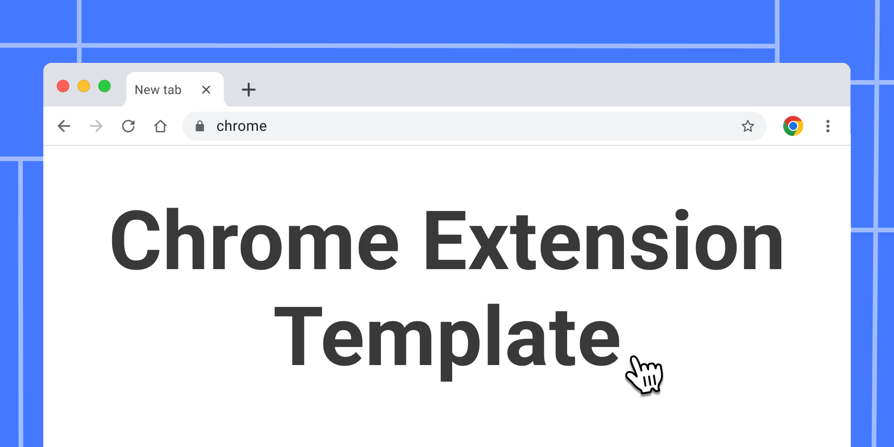
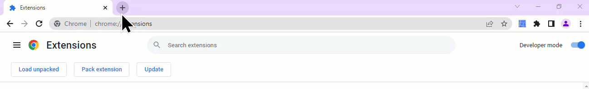
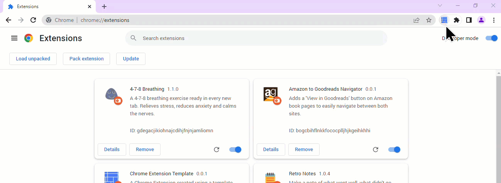
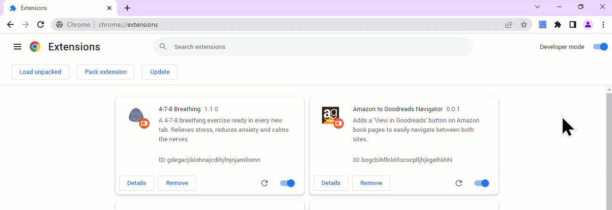
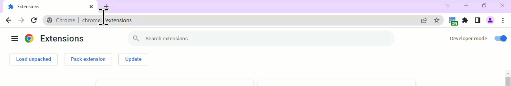
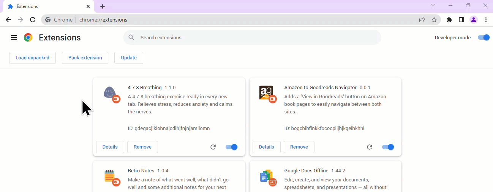
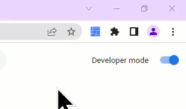
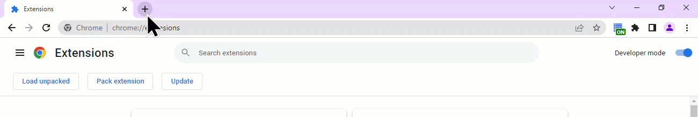
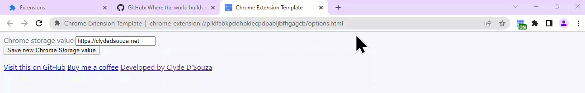

# Chrome Extension Template
A Chrome Extension created using a template.

## What does this include? 
### Override Chrome's new tab



This extension will automatically override the new tab page. A single extension is limited to overriding only one of the three possible pages.

```json
"chrome_url_overrides" : {
    "newtab": "newtab.html"
},
```

Just delete the above block from the `manifest.json` file to remove the entry point of this functionality. If you want to remove all references to this code, you'll also have to delete files from folder and references from webpack.

### Options page



This extension supports the use of an options page. 

```json
"options_page": "options.html",
```

Just delete the above block from the `manifest.json` file to remove the entry point of this functionality. If you want to remove all references to this code, you'll also have to delete files from folder and references from webpack.

### Action and popup



An action is an icon that shows up in the toolbar. This extension will also show an action icon in the toolbar. This extension also supports the use of a popup window, which is a special window after the user clicks the action icon. It also registers a keyboard shortcut to open this action popup. 

```json
"action": {
    "default_popup": "popup.html",
    "default_title": "Open template popup"
},
"commands": {
    "_execute_action": {
        "suggested_key": {
            "default": "Alt + Shift + L"
        }
    }
}
```

Just delete the above block from the `manifest.json` file to remove the entry point of this functionality. If you want to remove all references to this code, you'll also have to delete files from folder and references from webpack.

### Content script



This extension injects a content scripts into a website that matches the github.com domain. At this stage, it only prints a value to the console, but you can build on top of that pretty easily. 

```json
"content_scripts": [{
    "matches": ["*://github.com/*"],
    "js": ["content_scripts.js"]
}],
```

Just delete the above block from the `manifest.json` file to remove the entry point of this functionality. If you want to remove all references to this code, you'll also have to delete files from folder and references from webpack.

### A background script



This extension also comes baked in with a background script. This only listens for a single event at the moment and redirects the user to my website, but you should be able to build on top of this pretty easily.

```json
"background": {
    "service_worker": "background.js"
},
```

Just delete the above block from the `manifest.json` file to remove the entry point of this functionality. If you want to remove all references to this code, you'll also have to delete files from folder and references from webpack.

### Custom keyboard commands



This extension also comes baked in with two keyboard commands that will set different badges to the action icon. The background script contains the event listeners for this. This functionality is only provided for demo purpose only. 

```json
"commands": {
    "turn-on": {
        "suggested_key": {
            "default": "Alt + Shift + M"
        },
        "description": "Adds an ON badge to the action icon."
    },
    "turn-off": {
        "suggested_key": {
            "default": "Alt + Shift + N"
        },
        "description": "Adds an OFF badge to the action icon."
    }
}
```

Just delete the above block from the `manifest.json` file to remove the entry point of this functionality. If you want to remove all references to this code, you'll also have to delete files from folder and references from webpack.

### Omnibox



This extension support the omnibox feature which can be triggered by typing in `@@` in the omnibox, i.e., Chrome's address bar. An event is added in the background script which will take the text value and open up 3 tabs to social media sites with the text value as the usernames. The background script contains the event listeners for this. 

```json
"omnibox": { 
    "keyword" : "@@" 
},  
```

Just delete the above block from the `manifest.json` file to remove the entry point of this functionality. If you want to remove all references to this code, you'll also have to delete files from folder and references from webpack.

### Permissions



This repo uses the `chrome.storage.sync` API to demonstrate a simple get and set of a storage value. To be able to use Chrome storage, we need to add it to the permissions list like the snippet below. 

```json
"permissions": [
    "storage"
],
```

Just delete the above block from the `manifest.json` file to remove the permissions and also all references to storage. 

## Building and testing it locally
Run `npm run build:prod` first to produce production ready files in the `dist` folder. Follow [these instructions](https://superuser.com/a/247654) to install this extension locally. Use the generated `dist` folder as the folder containing the extensions code to load. Once installed, the extension will take effect and you should be able to spot all the changes.

For front-end changes, like implementing UI updates on the options page, for example, after following the steps above, you could run `npm run build` and that will start webpack. Webpack will monitor for any changes to the code base, compile the changes and the next time you refresh the options page, you should see your new updates.

## Automatic build and deployment
This repository includes a GitHub Workflow file which will build the solution, run tests and test coverage and also publish the extension to the Chrome Web Store.

You will need to add 4 secrets to your GitHub repository and the names should match the names the snippet below. Example, you should have a secret named `CHROME_REFRESH_TOKEN` in your GitHub repo for your Workflow file to have access to this. 

```yaml
refresh-token: ${{ secrets.CHROME_REFRESH_TOKEN }}
client-id: ${{ secrets.CHROME_CLIENT_ID }}
client-secret: ${{ secrets.CHROME_CLIENT_SECRET }}
file-name: './extension.zip'
app-id: ${{ secrets.CHROME_APP_ID }}
```

The values for `CHROME_REFRESH_TOKEN`, `CHROME_CLIENT_ID` and `CHROME_CLIENT_SECRET` can be retrieved by following [this guide](https://github.com/ClydeDz/google-api-keys-docs/blob/main/How%20to%20generate%20Google%20API%20keys.md). 

To obtain the `CHROME_APP_ID`, you'll need to upload a version of your Chrome extension to the Chrome Web Store Developer Dashboard. This will create a draft version of your extension and generate an ID for you. Each extension gets a unique ID. 

## Design assets
This repo has boilerplate icons and images which you'd want to replace with something apt to the extension you're building. Duplicate my [Figma Chrome extension template](https://www.figma.com/community/file/1127061326249481158) to get started with your design requirements for your Chrome extension.

## Credits
Developed by [Clyde D'Souza](https://clydedsouza.net/)